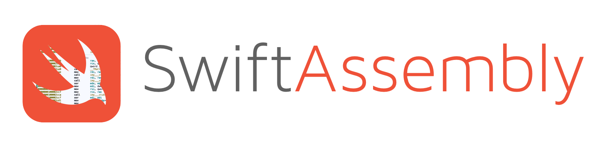
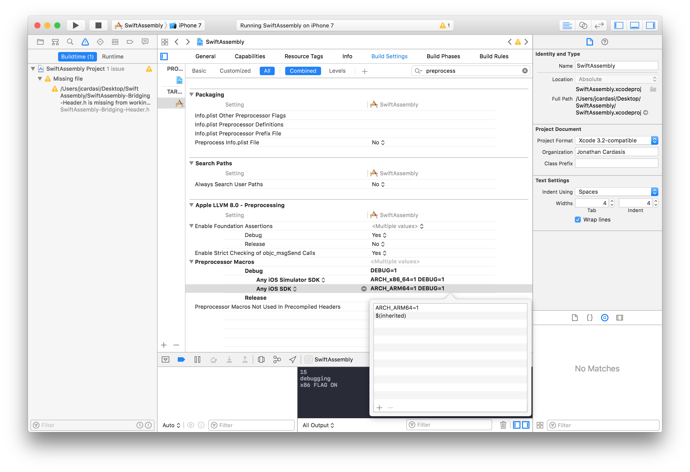
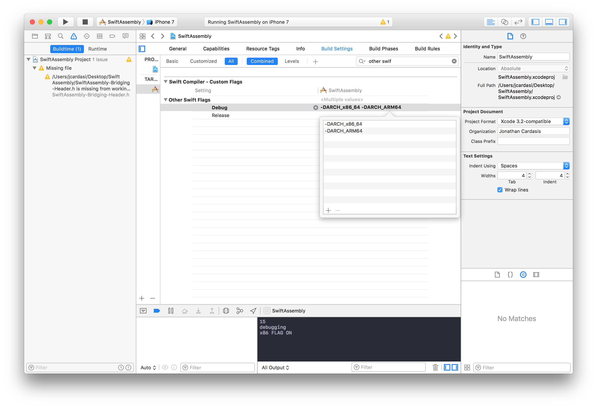

A proof of concept utilizing ARM and Intel x86 64bit Assembly code within Swift.


### Knowing your architectures
All iOS devices released so far are based off the ARM architecture. Since the iPhone 5S we have been running on 64-bit processor and now use ARM64.

Now the iOS Simulator we have all come to love is just that. A simulator. We are simulating the iOS platform using our hardware. MacOS runs on the Intel x86 64bit architecture. Therefore that is what our simulator is utilizing.

###### Well what does this mean for me?

It means we can't run the same assembly code on our physical iOS device that we run on the simulator \*gasp\*. If we want our Swift Assembly blend to run on both physical devices and simulators we will need to write code for both architectures. Welcome to the world of early development where nothing is cross platform.


## Linking for proper architectures
We need to tell [clang](http://clang.llvm.org/) that we only want to compile our ARM code when we build for devices and x86 code when we build for the simulator. The easiest way to do this is with preprocessor macros.

###### Set the macros based on the sdk. 
We'll have to do this for each build configuration.


###### Expose macros to Swift
Now we need to expose these macros to the Swift compiler. Note that in order to expose the macro we prepend it with *-D*.



Awesome. Let's create some assembly code. Here I'll make a procedure which adds two quad words (32-bit integers)

##### Let's create a .asm file for ARM:
```Assembly
#if ARCH_ARM64

.align 4
.global _addTwo
_addTwo:
    sub sp, sp, #16
    stp x1, x0, [sp]
    ldp x1, x0, [sp]
    add x0, x0, x1      
    add sp, sp, #16
    ret

#endif
```

##### And another one for Intel x86:
```Assembly
#if ARCH_x86_64

.globl _addTwo
_addTwo:
    pushq %rbp              // push the base pointer
    movq %rsp, %rbp         // establish stack frame
    movq %rdi, -0x8(%rbp)   // first parameter
    movq %rsi, -0x10(%rbp)  // second parameter
    movq -0x8(%rbp), %rsi
    addq -0x10(%rbp), %rsi  // add the second parameter to rsi
    movq %rsi, %rax         // move result from rsi to rax to be returned
    popq %rbp               // restore base pointer
    retq
#endif
```

Notice that we check for the macros here to prevent the other trying to compile for the wrong architecture.

Now we need to expose these global functions we made in assembly. Now Swift can't directly link to this so we will have to do so in C.

Create a Bridging Header and add the following line:

```C
extern int addTwo(int a, int b);
```

This exposes our assembly addTwo procedure and now we can call it in Swift! (Note that in C/Assembly relationship we link with extern and the function will be the same name minus a leading '_')

```Swift
print("Assembly Say: \(addTwo(3,5))")
```


